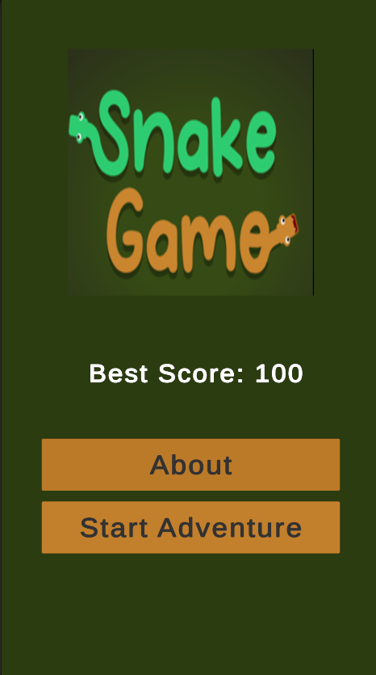
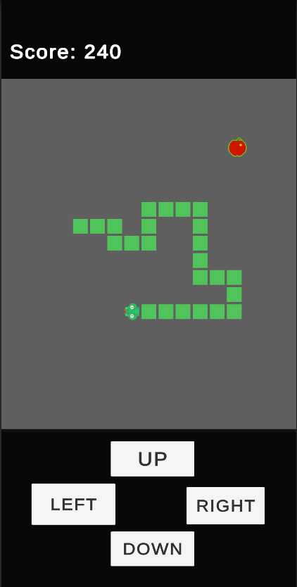
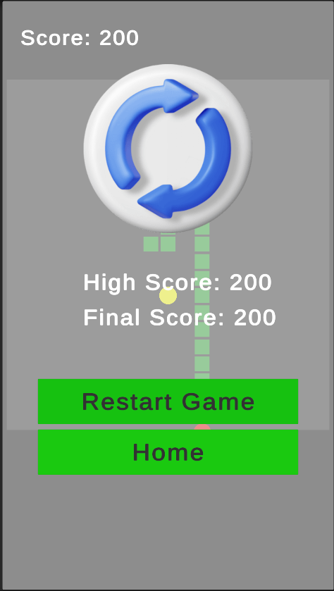
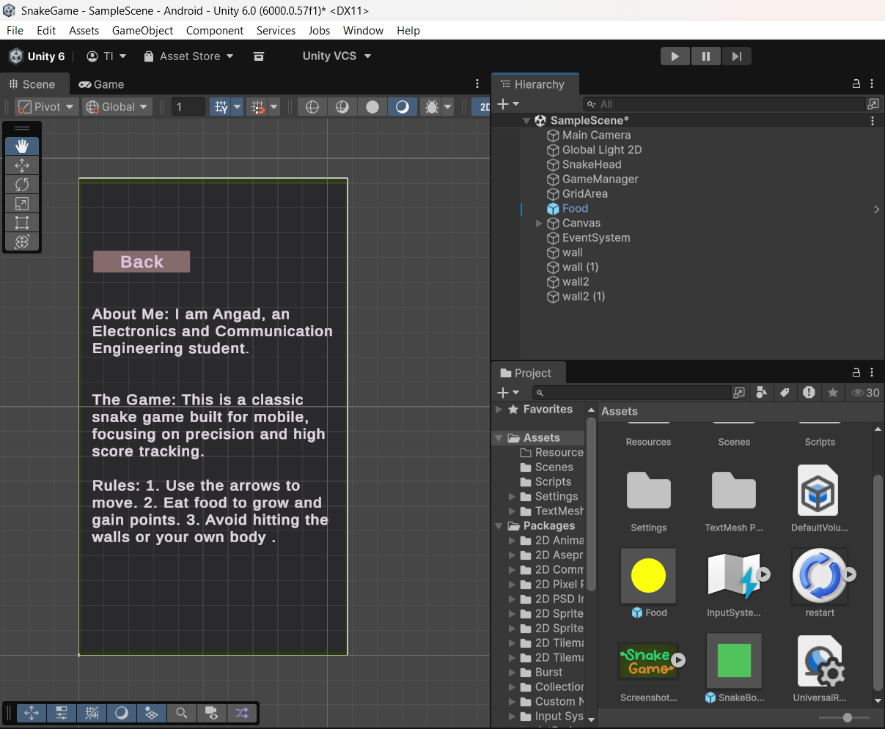

# Snake Game - Unity 2D

<h3>Project Overview</h3>

This Snake Game is a modern take on the classic arcade experience, developed using the Unity Engine. The project focuses on grid-based movement, dynamic object spawning, and state management. The player must navigate the snake to consume food, which causes the snake to grow in length and increases the player's score.

## ⚙️ Mechanics

* High Score System: I implemented a persistent scoring system that tracks the player's best performance across sessions.
* Procedural Spawning: Food spawn at random coordinates within the game boundaries, ensuring no two playthroughs are the same.
* Growth Logic: Each time food is consumed, a new segment is instantiated and parented to the snake's tail, increasing the difficulty as the player occupies more screen space.
* Collision Detection: Developed logic to handle triggers for wall collisions and self-collisions, resulting in an immediate "Game Over" state.

## 🚀 Features
* Smooth 2D movement.
* Randomized food spawning.
* Score tracking system.
* Game Over logic when hitting walls or self.

## 🛠️ Built With
* **Game Engine:** [Unity](https://unity.com/)
* **Language:** C#
* **Editor:** VS Code

## 📸 Gallery
| Main Menu | Gameplay | High Score | Unity view |
| :---: | :---: | :---: | :---: |
|  |  |  |  |

## 🎮 How to Play
1. Clone the repository.
2. Open the project in Unity (Version Unity 6.0(6000.0.57f1)*.
3. Press **Play**.
4. Use **Arrow Keys** or **WASD** to move.
